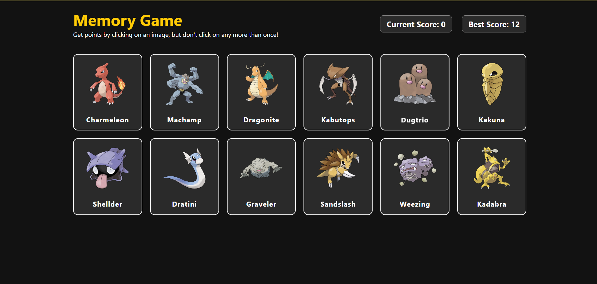

# 🎮 Memory Game — Pokémon Edition

A simple browser memory game built with **React** and **Vite**. Cards are populated with random Pokémon fetched live from the [PokéAPI](https://pokeapi.co/). Click a card to score a point — but click the same one twice and it's game over!



## How to Play

1. A grid of 12 cards loads, each showing a random Pokémon.
2. Click on any card to earn a point and shuffle the board.
3. Keep clicking **different** cards to keep your streak going.
4. Click a card you've already clicked and the game resets your current score to 0.
5. Click through all 12 unique cards without repeating and you win!
6. Your best score is saved locally, so it persists between visits.

## Features

- Live Pokémon data and artwork pulled from the PokéAPI
- Cards reshuffle after every click to keep the game challenging
- Current score and best score tracked live on the scoreboard
- Best score persisted in the browser via `localStorage`
- Built with React 19 + Vite for a fast dev experience

## Tech Stack

- [React](https://react.dev/)
- [Vite](https://vitejs.dev/)
- [PokéAPI](https://pokeapi.co/) for card data and images
- ESLint for linting

## Getting Started

### Prerequisites

- [Node.js](https://nodejs.org/) (v18 or later recommended)
- npm

### Installation

```bash
npm install
```

### Run in development mode

```bash
npm run dev
```

Then open the local URL Vite prints in your terminal (usually `http://localhost:5173`).

### Build for production

```bash
npm run build
```

### Preview the production build

```bash
npm run preview
```

### Lint

```bash
npm run lint
```

## Project Structure

```
ODP-Memory_Card/
├── index.html
├── src/
│   ├── main.jsx           # App entry point
│   ├── App.jsx             # Main game logic and state
│   ├── App.css
│   ├── components/
│   │   ├── card.jsx        # Single card component
│   │   └── scoresboard.jsx # Current/best score display
│   ├── styles/
│   │   ├── card.css
│   │   └── scoresboard.css
│   └── utils/
│       ├── api.js           # Fetches random Pokémon from PokéAPI
│       └── shuffleCards.js  # Fisher–Yates shuffle helper
└── package.json
```

## Credits

Pokémon data and artwork provided by [PokéAPI](https://pokeapi.co/).
